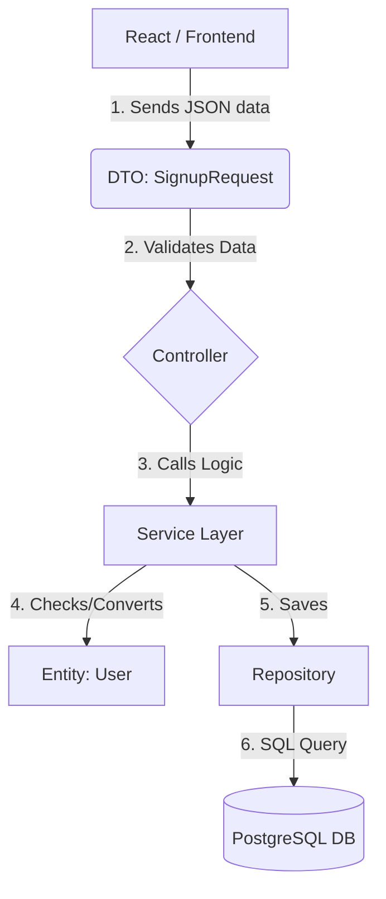

# 🎓 Skill Loop: Backend Master Class (Day 6-7)

## 1. The "Entity" (`User.java`)
**Think of this file as a "Translation Dictionary".**
Java speaks Objects (`User`). Database speaks Tables (`users`). This file tells java how to translate between them.

### Key Annotations Explained:

1.  **`@Entity` & `@Table(name="users")`**
    *   **Meaning:** "Hey Spring Boot, this class `User` represents a row in the SQL table named `users`."
    *   **Why?** So you never have to write `CREATE TABLE users...` yourself. Java does it for you.

2.  **`@Id` & `@GeneratedValue`**
    *   **Meaning:** "This looks like the Primary Key."
    *   **`IDENTITY` strategy:** "Let Postgres decide the number (1, 2, 3...) automatically."
    *   **Why?** Every user needs a unique ID badge.

3.  **`@NotBlank` & `@Email` (Validation)**
    *   **Meaning:** "Stop the code if the name is empty or email is weird."
    *   **Why?** Safety. Don't let bad data enter the kitchen.

4.  **`@ElementCollection` (The List Trick)**
    *   **Code:** `List<String> skillsOffered;`
    *   **The Problem:** SQL Tables are flat like Excel. You can't put a "List" inside a single Excel cell.
    *   **The Magic:** Spring Boot automatically creates a *second invisible table* (`user_skills_offered`) to store these skills and links them to the user. You don't see it, but it handles the complexity for you.

5.  **`@CreationTimestamp`**
    *   **Meaning:** "The moment this row is saved, stamp the current time."

---

## 2. Lombok Magic (`@Data`)
You noticed we didn't write:
```java
public String getName() { return name; }
public void setName(String n) { this.name = n; }
```
**Why?** Because of **`@Data`**.
*   **Lombok** is a library that runs *during compilation*.
*   It looks at your code, sees `@Data`, and **invisibly generates** all the Getters, Setters, `toString()`, and `equals()` methods for you.
*   It saves us 100 lines of boring "Boilerplate" code.

---

## 3. The Repository (`UserRepository.java`)
**Think of this as the "Data Access Object" (DAO).**

```java
public interface UserRepository extends JpaRepository<User, Long>
```

**The Magic:**
*   You wrote **ZERO** code in this file.
*   But purely by extending `JpaRepository`, you instantly get 50+ methods for free:
    *   `userRepository.save(user)` -> INSERT INTO users...
    *   `userRepository.findById(1)` -> SELECT * FROM users WHERE id=1
    *   `userRepository.delete(user)` -> DELETE FROM users...

**Custom Finders:**
*   You wrote: `Optional<User> findByEmail(String email);`
*   Spring is smart. It reads the method name **"findByEmail"** and writes the SQL: `SELECT * FROM users WHERE email = ?`.
*   If you wrote `findByNameAndRole`, it would write `WHERE name = ? AND role = ?`.

You literally "program by naming methods".

---

## 4. The Visual Flow: Ek Glance mein Poora System 📸

Is diagram ko dekh, sab clear ho jayega.



---

## 5. The "Kyun?" Session (Deep Dive) 🤔

### Q1: DTO vs Entity (Dono Data hold karte hain, to 2 kyu?)
*   **Entity (`User.java`) = Tijori (Safe)** 🔐
    *   Ye seedha Database se juda hai. Isme `Password`, `Salary`, `SecretKeys` sab kuch ho sakta hai.
    *   Agar hum Entity ko seedha bahar (Frontend) bhej dein, to galti se **Password leak** ho sakta hai.
*   **DTO (`SignupRequest.java`) = Menu Card / Tray** 📋
    *   Ye sirf wahi data rakhta hai jo public ko dikhana hai.
    *   Use: **Safety**. Tijori (Entity) ko basement mein rakho, aur Customer ko sirf Tray (DTO) dikhao.

### Q2: Controller vs Service (Manager vs Chef)
*   **Controller (`AuthController`)**:
    *   Iska kaam bas "Traffic Police" jaisa hai.
    *   Request aayi? Validate kiya (`@Valid`). Service ko paas kiya. Response wapas kiya.
    *   **Rule:** Controller mein kabhi complex logic mat likhna.
*   **Service (`AuthService`)**:
    *   **Asli Brain yahan hai.**
    *   "Email unique hai?" -> Service check karega.
    *   "Password Hash karna hai?" -> Service karega.
    *   Controller bas order leta hai, khana Service banata hai.

---

## 6. Code Walkthrough: "Bhai, Data Kahan Ja Raha Hai?" 🚀

Dekh, jab user "Signup" button dabata hai, to peeche kya hota hai, wo samajh.

**Analogy: The Restaurant Kitchen** 👨‍🍳

1.  **React (The Customer):**
    *   Customer chilaya: *"Ek plate Prateek, extra spicy!"*
    *   Technically: Sends a POST request with JSON `{ "name": "Prateek", ... }`.

2.  **DTO `SignupRequest` (The Waiter's NotePad):**
    *   Waiter sab kuch "NotePad" pe likhta hai.
    *   Agar Customer ne naam nahi bola (`@NotBlank`), to Waiter wahi tok dega: *"Sir, naam to batao!"*
    *   Kitchen (Database) ganda nahi hona chahiye, isliye Waiter pehle hi check kar leta hai.

3.  **Controller `AuthController` (The Manager):**
    *   Manager order leta hai.
    *   Manager khud khana nahi banata. Wo bas `Service` ko order pass karta hai: *"Chotu, table 5 ka order laga!"*

4.  **Service `AuthService` (The Chef):** 🍳
    *   **Logic yahan hoti hai.**
    *   Chef check karta hai: *"Kya hamare paas ye ingredient (Email) pehle se hai?"* (`existsByEmail`).
    *   Agar haan, to order cancel (Error).
    *   Agar nahi, to wo naya Dish (`User` object) banata hai aur Store Room (`Repository`) mein bhejta hai.

5.  **Repository `UserRepository` (The Store Room Guy):**
    *   Iska bas ek kaam hai: Cheezon ko **Shelf (Database Table)** pe rakhna aur wahan se uthana.
    *   Ye `save()` method chalata hai aur data Postgres mein permanent ho jata hai.

---

## 5. Frontend & Backend: "Ye aapas mein baat kaise karte hain?" 🤝

Tu soch raha hoga: *"React to JavaScript hai, Spring Boot Java hai. Inki dosti kaise hui?"*

**Answer: HTTP & JSON (The Translator)** 🗣️

*   **Java** aur **JS** ek doosre ko nahi samajhte.
*   Isliye wo **JSON** mein baat karte hain. JSON ek "Chitthi" (Letter) jaisa hai jo koi bhi padh sakta hai.
*   React chithhi likhta hai: `POST /signup`.
*   Internet (Network) wo chithhi leke Spring Boot ke darwaze (Port 9090) pe khat-khatata hai.

**The "CORS" Lafda (Important Interview Q)** 🚧
*   By default, Browser bohot shaqi (suspicious) hota hai.
*   Agar React (`Port 5173`) se chithhi aati hai, aur Spring Boot (`Port 9090`) pe jaati hai, to Browser beech mein kood jata hai: *"Oye! Tu doosre ghar (Port) mein kyun jhank raha hai?"*
*   Isliye humne Controller pe `@CrossOrigin` lagaya.
*   Iska matlab: *"Spring Boot ne Browser ko bol diya: 'Jane de bhai, ye React apna hi ladka hai'."*

---

## 6. Error Log: "Jo Raita Phaila Aur Humne Sameta" 🧹

Aaj humne 3 bade issues face kiye. Senior dev ki tarah samajh ki humne kya kiya:

### Error 1: Lombok ka Dhoka 💔
*   **Kya hua:** Server start hi nahi ho raha tha. Bol raha tha `getId() not found`.
*   **Kyun hua:** Humara Java version (v24) bohot naya hai. Lombok (jo code generate karta hai) abhi tak update nahi hua. Dono ki ladai ho gayi.
*   **Fix:** Humne bola *"Bhaad mein ja Lombok"*. Humne purane style mein haath se `Getter/Setter` likh diye.
*   *Lesson:* Kabhi kabhi "Magic Libraries" fail ho jati hain. Old School tareeka hamesha kaam aata hai.

### Error 2: "Port Occupied" (Traffic Jam) 🚦
*   **Kya hua:** Server bola `Port 9090 already in use`.
*   **Kyun hua:** Puraana wala server background mein chhup ke chal raha tha. Ek कुर्सी (Port) pe do log nahi baith sakte.
*   **Fix:** Terminal command `kill` chala ke purane wale ko uda diya.

### Error 3: "Unresolved Compilation" (Kachra Files) 🗑️
*   **Kya hua:** Code sahi tha, fir bhi error aa raha tha.
*   **Kyun hua:** Maven ke `target` folder mein purani "tuti-futi" files padi thin.
*   **Fix:** `mvn clean`. Isne puraana kachra saaf kiya aur zero se sab kuch wapas build kiya.

---

## 7. Top Interview Questions (Backend/Spring Boot) 🎤

### Q1: What is Dependency Injection (IOC) in Spring?
"It means I don't create objects myself (`new CheckService()`). Instead, I let Spring create and manage them in its Container. When I need a service, I just ask for it (`@Autowired`), and Spring 'injects' it. This makes the code loosely coupled and easier to test."

### Q2: What is the difference between `@Component`, `@Service`, and `@Repository`?
"Technically they are the same (they define a Bean). But semantically:
*   `@Repository`: Indicates Database Layer (and handles SQL Exceptions).
*   `@Service`: Indicates Business Logic Layer.
*   `@Controller`: Indicates Web/API Layer."

### Q3: What is "Lazy Loading" in Hibernate?
"It means Hibernate won't fetch related data (like `skills` list) from the database until I actually ask for it in the code (`user.getSkills()`). This saves performance. The opposite is `Eager Loading`, which fetches everything immediately."

### Q4: Why use DTOs instead of Entities in the Controller?
"An Entity (`User`) matches the Database exactly. If I expose it, I might accidentally leak sensitive fields like `password`. A DTO (`SignupRequest`) is a plain object that contains only the data the API *needs*, separating the API contract from the Database Schema."

### Q5: What is the `pom.xml` file?
"It is the Project Object Model for **Maven**. It manages my dependencies (libraries like Spring Web, Postgres Driver). I just declare the name and version, and Maven downloads the JAR files automatically."
